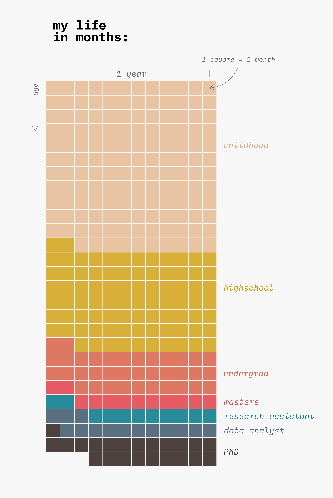

# Hi,

I am a PhD student in the NERC Centre for Doctoral Training in Quantitative and Modelling Skills in Ecology and Evolution (QMEE). I am broadly interested in community ecology, the compexities of ecosystems and how they respond to change.  

My current research focuses on the role of pre-dispersal insect seed predators in maintaining tropical plant diversity in Panama. I am using using long-term datasets of seed rain to model community dynamics and collecting information on individual plant species and their enemies in the field.

My previous research has seen me experimentally evolving phytoplankton in the field and extracting bacterial DNA in the lab.

<b>Interests</b>
<li>Community ecology</li>
<li>Evolutionary ecology</li>
<li>Global change</li>
<li>Data analysis & visualisation</li>

<b>Education</b>
<ul class="fa-ul">
  <li><i class="fa-li fas fa-graduation-cap"></i>MRes Biodiversity, Evolution & Conservation, 2017</li>
  
<i>University College London</i>

  <li><i class="fa-li fas fa-graduation-cap"></i>BSc Zoology, 2016</li>
  
<i>University of Exeter</i>

</ul>

