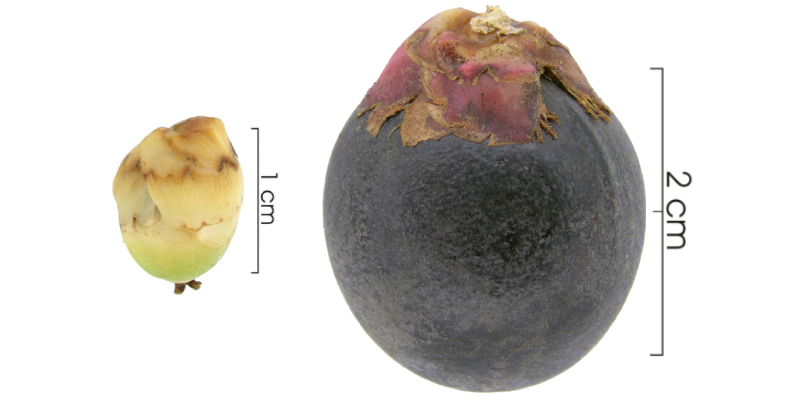

<figure>
  
  <figcaption>Immature and mature fruits of <i>Oenocarpus mapora.</i> Photos: <a href= https://biogeodb.stri.si.edu/bioinformatics/dfm/metas/view/9429>STRI</a></figcaption>
</figure>

Walking around a tropical forest it is not uncommon to come across unripe fruits on the forest floor. Trees will often abort the development of their offspring if deemed unlikely to survive, allowing them to fall and die. This may seem wasteful, however, growing fruits to maturation is energetically expensive for the plant. With limited resources, it may be more beneficial for a plant to cut its losses and abort some of its fruits.

Plants may prematurely abort their fruits if the offspring becomes damaged. Fruits contain energy-rich sugars and nutrients to attract dispersal agents, however, many groups of animals have become predatory. They differ from seed dispersers, as rather than digesting the fruit and leaving the seed unharmed, a seed predator will eat the seed, killing it in the process. The seed itself is an individual organism (or soon to be one), hence the term 'predator' rather than 'herbivore'.

One of the more widespread groups of seed predators in tropical forests are internally-feeding insects, which lay their eggs on fruits and spend their larval phase feeding on the plant's seeds. The vast majority are highly host-specific, with each species of insect predating upon a single plant species.

<figure>
  
  <figcaption>Fruits dropped prematurely are unlikely to germinate. Created with <a href= https://biorender.com>BioRender.com</a></figcaption>
</figure>

If seed predators (or other enemies of seeds, e.g. pathogens) are causing trees to drop their fruits before they are fully developed, they could also contribute to maintaining tropical plant diversity. Seed enemies are more abundant in areas where there are many of their host seeds. Therefore, in areas of the forest where many trees of the same species grow close to each other, the tree's offspring may be more likely to come under attack and die. This mechanism (known negative density-dependence) works to prevent a single tree species from dominating the forest, encouraging the tremendous number of tree species found in tropical forests. 

For the first project of my PhD, I wanted to find out if seed enemies could be causing trees to drop their fruits prematurely. To do this, we took advantage of a huge data collection effort co-ordinated by Joe Wright which has been on-going on Barro Colorado Island, Panama for over 30 years. Two hundred seed rain traps have been set up on the island – a simple construction of PVC pipes and netting – which collect any fruits or seeds which fall from the canopy. Our collaborator Osvaldo Calderón checks the traps once a week and is able to identify the tree species from which the fruit fell and whether the fruit is fully ripe or whether it has been dropped prematurely.

<figure>
  
  <figcaption>Seed rain traps on Barro Colorado Island. </i> Photos: <a href= https://biogeodb.stri.si.edu/bioinformatics/dfm/metas/view/5982>STRI</a></figcaption>
</figure>

We found that across all 201 species in the data set, a large proportion of seeds were dropped before completing their development, almost 40%! This percentage was much higher for some tree species than others. Was there something about those tree species which made them more likely to drop their fruits prematurely? We predicted that species with properties that are likely to make them more to be vulnerable to attack would drop more of their fruit prematurely. For example, tree species which have larger seeds provide more food and therefore might be a bigger target for seed predators. We could then test if our predictions held up. From previous work, we also knew which tree species are attacked by those internally-feeding insects which I mentioned before.

<figure>
  
  <figcaption>Average rates of premature seed abscission across 31 years</figcaption>
</figure>

The results of our analysis found that 4 out of 6 of our predictions were supported and that tree species known to be attacked by internally-feeding insects had higher levels of premature fruit drop. These results are in support of the theory that seed predators could be causing some premature fruit drop. Combined with our finding that nearly 40% of seeds are dropped prematurely, this suggests that seed predators feeding on seeds in the canopy could have an important role in deciding which trees grow where.

The fate of trees in their earliest life stages, when they are still developing and attached to their mother tree, has on the whole been overlooked in tropical forests. Yet with so many individuals lost at this early stage, our study suggests that we should pay closer attention to the goings on up in the canopy if we want to understand how forests work.

__Read the paper [here](https://doi.org/10.1111/1365-2745.13867)__
