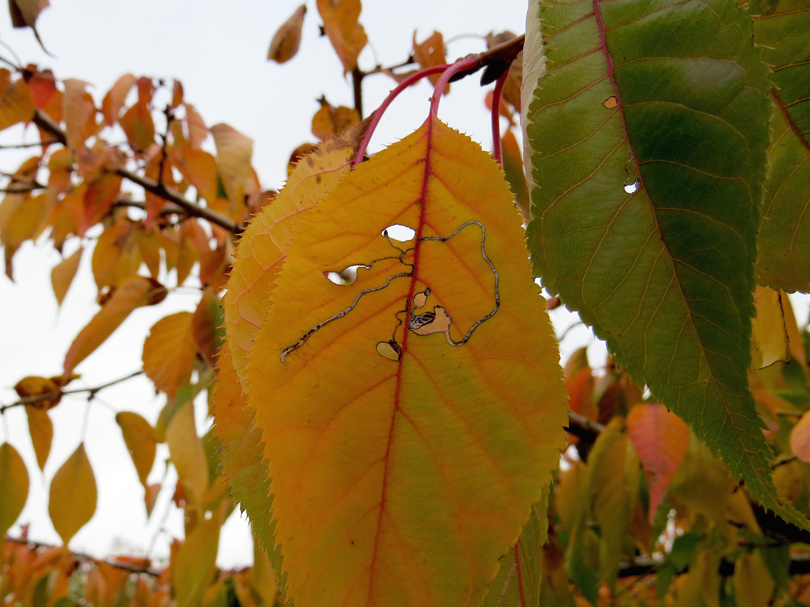

<figure>
  
  <figcaption>Leaf miner tracks on a Cherry tree</figcaption>
</figure>

Interactions between plants and their insect herbivores are one of the most studied types of ecological interactions. Multiple studies have identified huge variability in herbivory across different levels of biological organisation. A small fraction of plants can experience disproportionately high levels of herbivore damage, whilst the majority experience relatively low levels. Despite the potential ecological and evolutionary consequences of such variability, we still cannot explain why these patterns emerge so frequently in nature.

I am a site PI for the [Herbivory Variability Network](https://herbvar.org), a global collaboration of researchers which aims to describe and understand how and why patterns in plant–herbivore interactions vary across the tree of life and around the world.
