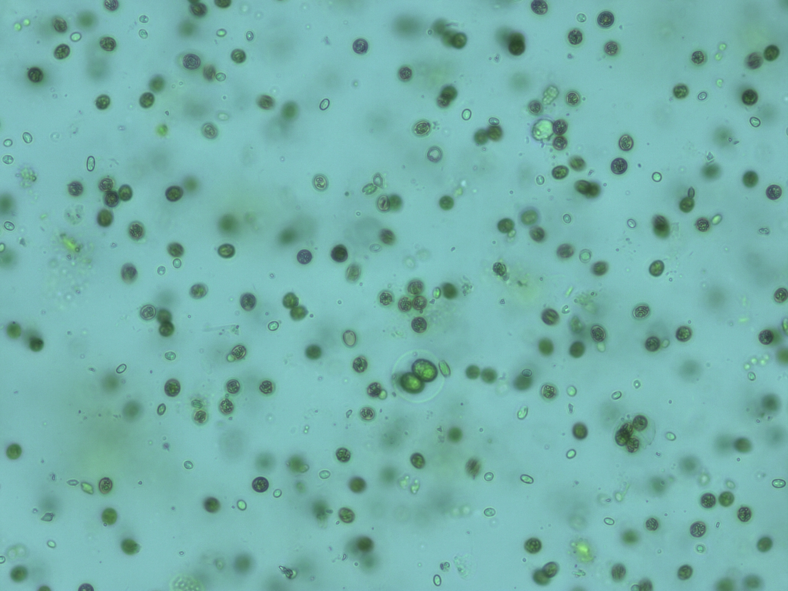

<figure>
  
  <figcaption>Phytoplankton from an experimentally heated mesocosm in October 2015</figcaption>
</figure>

[Phytoplankton](https://en.wikipedia.org/wiki/Phytoplankton) are the foundation of aquatic food-webs and contribute to 50% of global [primary production](https://en.wikipedia.org/wiki/Primary_production). In a rapidly changing climate, we expect phytoplankton to adapt and change, with repercussions for aquatic ecosystems.

During my undergraduate degree, and later as a research assistant, I worked with Gabriel Yvon-Durocher (University of Exeter) and Elisa Schaum (University of Hamburg), to disentangle the roles of ecology, physiology and evolutionary history in the adaption of phytoplankton to environmental change.
