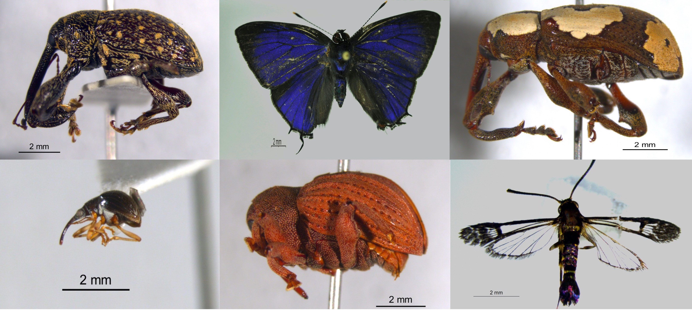

<figure>
  
  <figcaption>Pre-dispersal seed predators from Barro Colorado Island</figcaption>
</figure>

The high local species richness in tropical forests poses a challenge to [general ecological theory](https://en.wikipedia.org/wiki/Competitive_exclusion_principle), where competition for resources limits local alpha diversity through competitive exclusion. The [Janzen-Connell hypothesis](https://en.wikipedia.org/wiki/Janzen–Connell_hypothesis) proposes that coexistence is achieved through the role of specialist plant enemies, which reduce recruitment close to reproductive adults of the same species and in areas of high conspecific density.

The role of natural enemies in structuring and maintaining plant diversity in tropical forests is being increasingly recognised. To date, research has focused almost exclusively on enemies attacking seeds after dispersal from the parent plant. However, we don't know much about the fate of seeds that are still developing and attached to the parent plant. Pre-dispersal seed predation could cause a reduction in the number of seeds that are successfully dispersed, with unknown consequences for plant diversity maintenance. 

In collaboration with Joe Wright at the Smithsonian Tropical Research Institute and my PhD supervisors Sofia Gripenberg, James Bullock & Tom Oliver, I am using a long term dataset of seed rain from Barro Colorado Island, Panama, to investigate the role of pre-dispersal seed predation in plant diversity maintenance.
