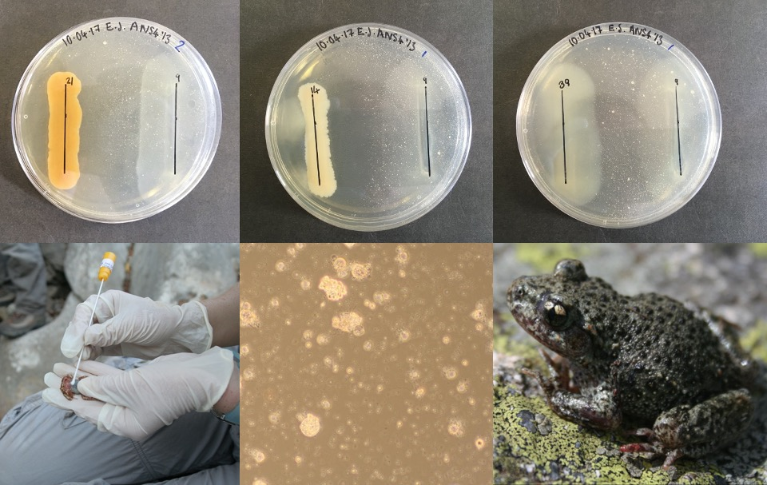

<figure>
  
  <figcaption>Upper: mTGhL agar plates with <i>Bd</i> spread evenly across the surface assayed against a streak of bacteria. Lower: photos of <i>Alytes obstetricans</i> and <i>Bd</i>.</figcaption>
</figure>

[Chytridiomycosis](https://en.wikipedia.org/wiki/Chytridiomycosis), a fatal skin disease caused by the fungal pathogen [_Batrachochytrium dendrobatidis (Bd)_](https://en.wikipedia.org/wiki/Batrachochytrium_dendrobatidis), is responsible for widespread declines and extinctions of amphibian species.

Bacterial communities associated with multicellular hosts [(microbiomes)](https://en.wikipedia.org/wiki/Microbiome) are well documented for their vital role in maintaining host health. Commensal bacteria resident on amphibian skin can inhibit the growth of _Bd_, and in doing so confer survival benefits to the host, suggesting that there may be a way to use probiotic therapy as a conservation strategy to mitigate the loss of amphibian species.

During my Master's degree, I worked with Xavier Harrison and Kieran Bates at the Zoological Society of London, to identify potential candidates for probiotic inoculation. I isolated and identified bacteria from the amphibian microbiome using 16S rRNA sequencing. Using a culture-based method, I then assessed the inhibitory capabilities of isolates against _Bd_.
